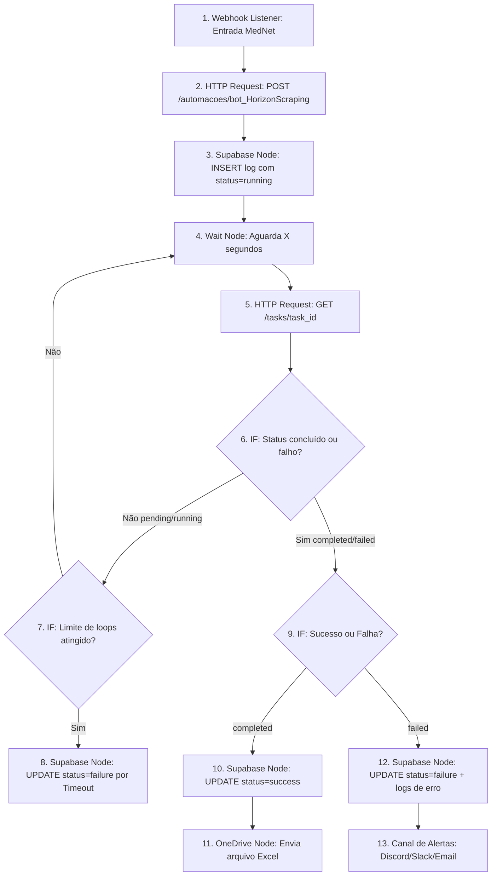

# Guia de Integração: n8n + FastAPI (VPS) + Supabase

Este guia detalha a arquitetura, os códigos práticos e as expressões exatas do **n8n** para integrar a plataforma MedNet ao seu **Orquestrador FastAPI** (na VPS) e ao **Supabase**.

---

## Desenho da Arquitetura



---

## 1. Segurança contra Loops Infinitos (Safety Counter)

No n8n, você tem duas maneiras de controlar o limite de repetições: a **nativa (Recomendada)** e a **via Nó Code**.

### Opção A: Usando a variável nativa do n8n (Sem Nó Code)
O n8n conta automaticamente quantas vezes um nó foi executado através do `$runIndex`. Você pode fazer a verificação direto no nó **IF** que valida o loop.

* No nó **IF** (que decide se volta para o Wait ou se encerra por timeout):
  * **Valor 1**: `{{ $node["HTTP Request: GET /tasks"].runIndex }}` (Substitua `"HTTP Request: GET /tasks"` pelo nome exato do seu nó de consulta).
  * **Operação**: *Larger or Equal* (Maior ou igual).
  * **Valor 2**: `40` (Para intervalo de 30 segundos, 40 repetições equivalem a 20 minutos).
  * *Rota True*: Atingiu o limite (Timeout) -> Vai para o UPDATE de falha.
  * *Rota False*: Menos de 40 voltas -> Volta para o nó **Wait**.

---

### Opção B: Iniciando e Incrementando um Contador Manual (Nó Code)
Caso queira maior controle ou expor a variável explicitamente no fluxo JSON:

1. **Antes de entrar no loop** (logo após o INSERT do Supabase), insira um nó **Code** (Modo: *Run once for all items*) para inicializar a variável:
   ```javascript
   // Nó: "Inicializar Contador"
   for (const item of $input.all()) {
     item.json.counter = 0;
   }
   return $input.all();
   ```

2. **Dentro do loop** (logo após o GET do status da tarefa), insira outro nó **Code** para incrementar:
   ```javascript
   // Nó: "Incrementar Contador"
   for (const item of $input.all()) {
     // Recupera o contador do nó de inicialização e soma o runIndex atual do nó de status
     item.json.counter = ($node["Inicializar Contador"].json.counter || 0) + $runIndex + 1;
   }
   return $input.all();
   ```

3. **Configuração do Nó IF de validação**:
   * **Valor 1**: `{{ $json.counter }}`
   * **Operação**: *Larger or Equal*
   * **Valor 2**: `40`

---

## 2. Expressão do UPDATE do Supabase

No nó final do Supabase (Ação: **Update**), você precisará apontar o registro criado no primeiro nó do Supabase.

* **Filtro (Row ID)**: `{{ $node["Supabase: Insert Inicial"].json["id"] }}`
* **Campos a Atualizar**:

### A. Campo `status` (Status da execução)
Injeta `"success"` se finalizado com sucesso, ou `"failure"` se falhar:
```javascript
{{ $json.status === 'completed' ? 'success' : 'failure' }}
```

### B. Campo `duration` (Tempo de Execução)
Caso sua API FastAPI não envie o tempo total calculado, você pode calcular no n8n a diferença de milissegundos entre o disparo inicial (Webhook) e o momento atual:
```javascript
{{ Math.round((new Date() - new Date($node["Webhook Entrada MedNet"].json.body.timestamp)) / 1000) }} s
```

### C. Campo `logs` (Concatenação de Arrays JSON)
Esta expressão pega os logs gerados na inicialização do fluxo (do nó do Supabase Insert) e junta/concatena com o array de logs detalhados retornado pelo FastAPI (`$json.logs`). 

* **Expressão no Campo Logs**:
```javascript
{{ 
  JSON.stringify(
    $node["Supabase: Insert Inicial"].json.logs.concat(
      ($json.logs || []).map(l => ({
        t: l.t || l.time || new Date().toLocaleTimeString('pt-BR'),
        lvl: l.lvl || l.level || 'info',
        m: l.m || l.message || 'Passo executado'
      }))
    )
  ) 
}}
```
> **Nota de Compatibilidade**: O mapeamento `.map` garante que, se os seus logs no Python retornarem chaves como `time` ou `message`, eles sejam convertidos para as chaves compatíveis com a MedNet (`t`, `lvl`, `m`).

---

## 3. Mapeamento de Erros do FastAPI

Se o orquestrador FastAPI retornar `status: "failed"`, as propriedades do erro estarão disponíveis no payload JSON do GET do status (ex: `{ "status": "failed", "error": "Playwright: Timeout ao carregar botão..." }`).

Para extrair e gravar essa mensagem na coluna `detail` da tabela `automation_logs`:

* **Expressão no Campo `detail`**:
```javascript
{{ $json.error || 'A VPS reportou falha interna na execução do robô.' }}
```

### Como estruturar o Log de Falha para a MedNet:
Se a tarefa falhar, certifique-se de que o nó do Supabase Update final receba o log de erro concatenado. O `Logs Expression` acima já cuidará de importar os logs do Python, mas você pode injetar uma linha final forçada no array usando:

* **Injeção de Log de Erro**:
```javascript
{{ 
  JSON.stringify(
    $node["Supabase: Insert Inicial"].json.logs.concat([
      {
        "t": new Date().toLocaleTimeString('pt-BR'),
        "lvl": "err",
        "m": "Execução encerrada com falha. Detalhe: " + ($json.error || 'Erro indefinido')
      }
    ])
  )
}}
```
 Desta forma, a tela de Automações da MedNet ficará vermelha com o log exato do erro de raspagem do Playwright.
